

    

# Upgrading Yamaha YIS805/128 to MSX2+

The fully illustrated upgrade guide. Revision 1.0

Copyright (c) 2019 by RBSC

## Abstract

The purpose of this document is to provide assistance in upgrading of the Yamaha YIS805/128 MSX2 and similar computers to MSX2+. Each upgrade step of this guide is fully illustrated. The upgrade must be done the way it's described in this document. Any alterations may result in a different end result or in a damage to the computer or components that are being used for the upgrade. The upgrade is fully reversible except for the VDP - you can convert your computer back to MSX2 any time. The upgraded VDP is backwards compatible with the original one.

---

:warning:
**WARNING!** If you don't have proper soldering skills, do not attempt to do this upgrade or you risk to damage the computer beyond repair! The RBSC is not responsible for any possible damages resulted from this upgrade. You are doing this upgrade solely on your own risk!

----

## Upgrade options

The upgrading of the Yamaha YIS805 MSX2 computer to MSX2+ requires several reversible modifications to the motherboard and installing several additional components. There are required upgrade options and additional upgrade options. The required upgrade options include:
-   installing the Yamaha v9958 VDP (Video Display Processor)
-   modifying the composite synchronization signal's output circuit 
-   upgrading the MSX BIOS and SubROM, relocating the disk ROM
-   expanding slot 0, installing 2 jumpers and adding FMPAC BIOS (FM Basic)
-   installing a socket instead of Z80 CPU, relocating the CPU
-   installing the special adapter board
-   adding F4 port to support warm boot as well as FM-PAC (OPLL based sound card)

The additional upgrade options add more usability and value to the upgraded computers. Those include:
-   upgrading the internal RAM to 256kb and adding 2 configuration jumpers
-   installing the Gotek floppy disk emulator as the first floppy drive
-   installing the improved video board with excellent S-Video and good color composite video outputs

## Required modifications

The below picture shows the areas on the motherboard where all the modifications need to be done. The more detailed pictures of the upgrade will follow.

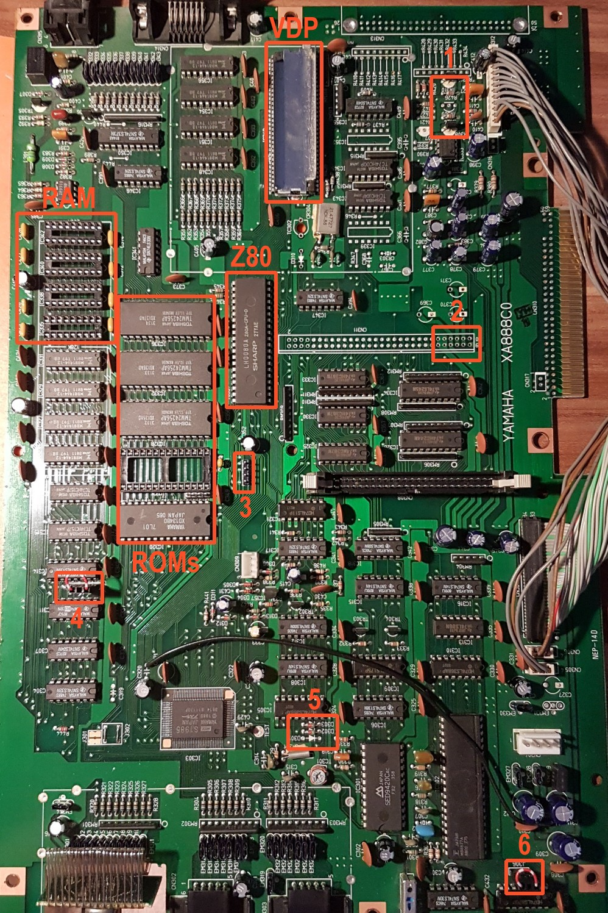

The v9958 VDP must be installed onto the motherboard first. The older VDP (v9938) must be removed. The initial step is to desolder and remove the heatsink that is located on top of the VDP chip. The heatsink has 2 solder points on the motherboard near the narrow chip's edges. On the below picture they are shown in red frames. Those points need to be heated so that the heatsink could be easily removed. Be careful not to cut your fingers with the sharp edges!

The old VDP should be removed by cutting away all its pins with diagonal cutters. Cut as close to the chip's body as possible. It's way safer than desoldering the entire chip from the motherboard. Once the body of the chip is removed, the remaining pins should be removed from the motherboard by gently pulling them with pliers and applying heat from the bottom side of the board.

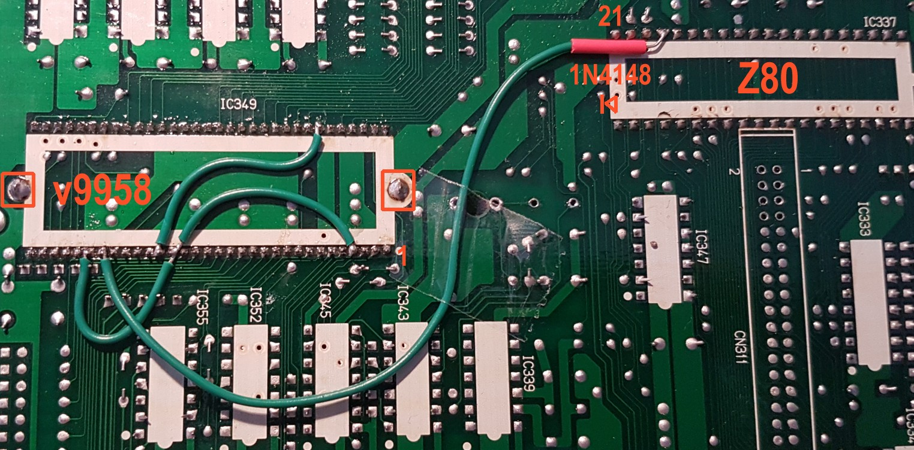

The new VDP could be installed into a socket, but we recommend to solder it directly onto the motherboard in order to prevent poor connection during the prolonged use. The new VDP has a slightly different pinout, so a few wires need to be soldered between the following pins:
-   **pin 21 - pin 58**
-   **pin 4 - pin 20 - pin 27**

Finally, the 1N4148 diode must be installed **between Z80's pin 24** and **v9958's pin 26**. The diode's **anode must be connected to pin 24 of the CPU**. It's highly recommended to put a small piece of shrinktube on the diode to protect its solder joints. The last step is to put back the previously removed heatsink. Please make sure that you put enough thermal paste (similar to the one used with modern CPUs) onto the VDP chip before installing the heatsink. The heatsink must be soldered from both ends. The video showing the VDP replacement could be found here:
-   **https://youtu.be/dz-oaFYrFdg?t=553**

As the new VDP misses a few internal filters, we need to modify the CSYNC output circuit on the motherboard. This requires removing the TR309 transistor and the R424 resistor from the board. Then a wire needs to be installed between the side solder pads of the removed transistor. And finally a ceramic 100nF capacitor of needs to be installed on top of the R426 resistor. See the below picture for reference.

    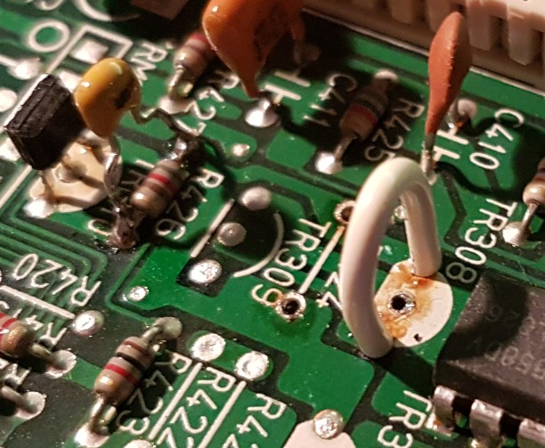

This concludes the installation of the new VDP chip. You might want to power up the computer to verify that the new chip produces the correct image before proceeding with the other modifications. If the picture doesn't appear, then check all connections or replace the VPD chip if necessary.

The next important step is to remove all old ROM chips from the motherboard. If you want the upgrade to be reversible, you might want to desolder these chips with hot air or with the desoldering pump. However, there's a risk of damaging the motherboard if it gets overheated. So you need to decide which way is better - to cut away the pins or to desolder the ROM chips. After removing the old ROM chips, you need to install five DIP28 sockets onto the motherboard for the new ROMs. In addition you need to install 100nF ceramic capacitor on C351 placeholder. And finally you need to install two 4-pin jumper pin headers and put 2 jumpers on them as shown on the below image. Those jumpers are needed to properly position the FMPAC BIOS in the computer's slot 0.

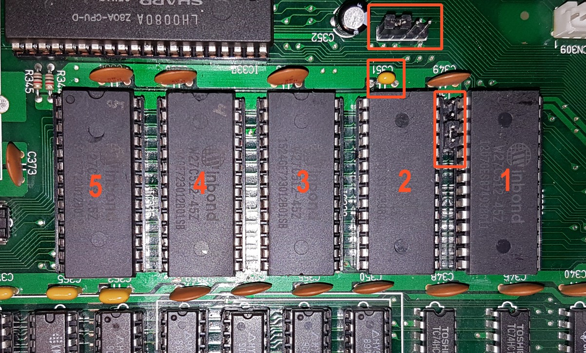

To complete the job you need to program 5 ROM chips with the necessary data using any EEPROM programmer. We recommend to use only the electrically erasable W27C512 EEPROM chips from Winbond. The chips on the above image are marked as 1,2,3,4 and 5. You need to write the data from the files with the corresponding names into the chips and put them into the sockets according to their numbering. The archive with the data is located here:

-   http://podrezov.com/yis805gotek/yis805_msx2p.zip
    
The data in the archive is already prepared to be written into the 65kb W27C512 chips. After programming a chip we recommend to mark its number with a permanent marker. This will help to insert the chip into the correct socket. The info about the new ROMs and their locations in computer's memory can be found in the below table:

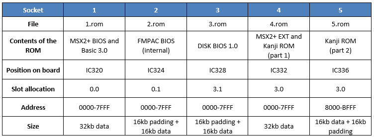
<!---
| Socket → | 1 | 2 | 3 | 4 | 5 |
| :---: | :---: | :---: | :---: | :---: | :---: | 
| **File** | 1.rom | 2.rom | 3.rom | 4.rom | 5.rom |
| **Contents of the ROM** | MSX2+ BIOS and Basic 3.0 | FMPAC BIOS   (internal) | DISK BIOS 1.0 | MSX2+ EXT   and Kanji ROM   (part 1) | Kanji ROM   (part 2) | 
| **Position on board** | IC320 | IC324| IC328 | IC332 | IC336 |
| **Slot allocation** | 0.0 | 0.1 | 3.1 | 3.0 | 3.0 |
| **Address** | 0000-7FFF | 0000-7FFF | 0000-7FFF | 0000-7FFF | 8000-BFFF |
| **Size** | 32kb data | 16kb padding + 16kb data | 16kb padding + 16kb data | 32kb data | 16kb data + 16kb padding |
--->

By default the slot 0 is not expanded, but we need it to be expanded. To expand the slot 0 for the FMPAC BIOS you need to solder the 1N4148 diode to D301 placeholder as shown on the below image. This will permanently expand slot 0 and permit to use FM Basic commands. The diode must be soldered with the same orientation as D302 and D303 diodes. If your computer already has slot 0 expanded, you won't need to install the new diode.

    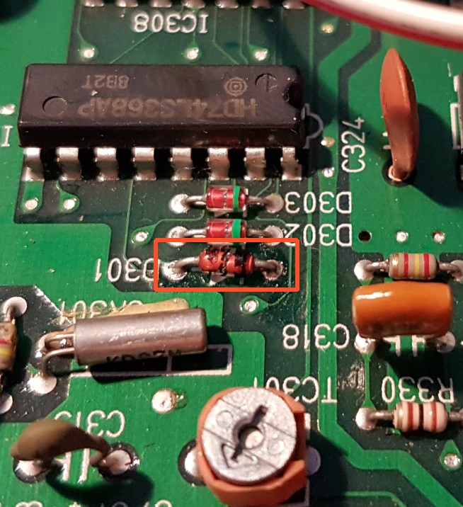

    
The next step is to remove the Z80 CPU put a DIP40 socket in its place. If you intend to use the original Z80 processor, then take the risk and carefully desolder it from the motherboard. The socket is required to install the special adapter board. As the Z80 is partially covered by the computer's power supply, there's not enough vertical space to install the combo board that contains the F4 port and FMPAC OPLL sound card. The F4 port is required for warm booting.

The adapter board requires 2 supports to be 3D-printed and installed under the board. Those are necessary to hold the board in place when installing or removing the F4/FMPAC combo board. Use the flathead screws to attach the supports to the adapter board before installation. You also need to put 2 pieces of thin double-sided sticky tape on the feet of both supports in order to glue them onto the motherboard. See the pictures below for reference:

    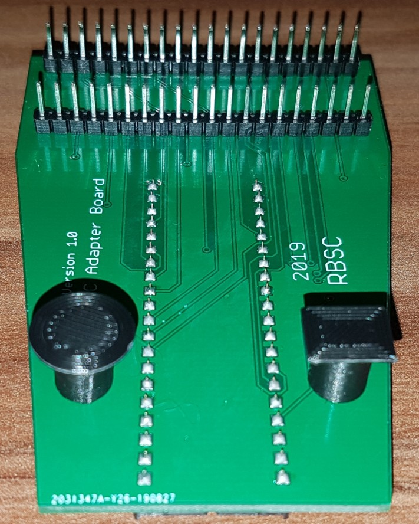
    &thinsp;
    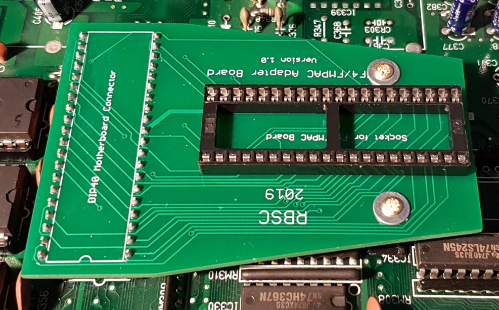

The adapter board is available as open-source project in the RBSC's Github repository. The 3D models of the supports can be downloaded from the other RBSC's repository on Thingiverse:
-   **https://github.com/RBSC/YIS805_Adapter** 
-   **https://www.thingiverse.com/thing:3860033**

To be able to connect the F4/FMPAC combo board to the motherboard you need to install 6-pin jumper pin header. The picture below shows the way that the pins must be installed. For the combo board v1.4 you will need to connect 4 wires: ground (GND), audio (AUD), +12V and -12V. Please make sure that you connect the 12V wires correctly or you will damage the amplifier on the combo board!

    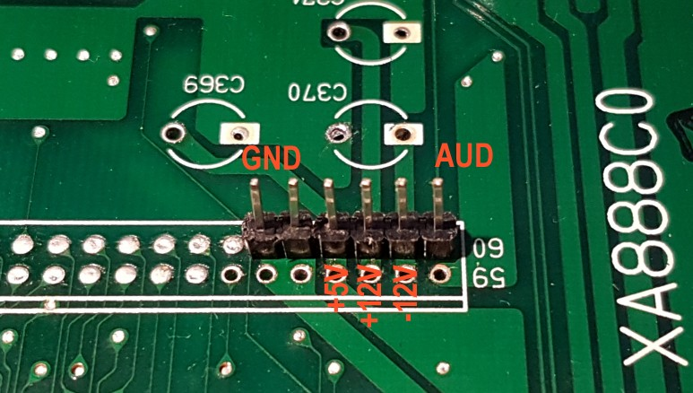

The assembled combo board (without the ROM chip) is installed into the socket of the adapter board by gently pushing it downwards. Please make sure that the pins of the combo board are connected to the socket in the right way or you may damage the Z80 CPU installed on the board. The picture below shows how the combo board is installed and connected to the newly-soldered pins on the motherboard.

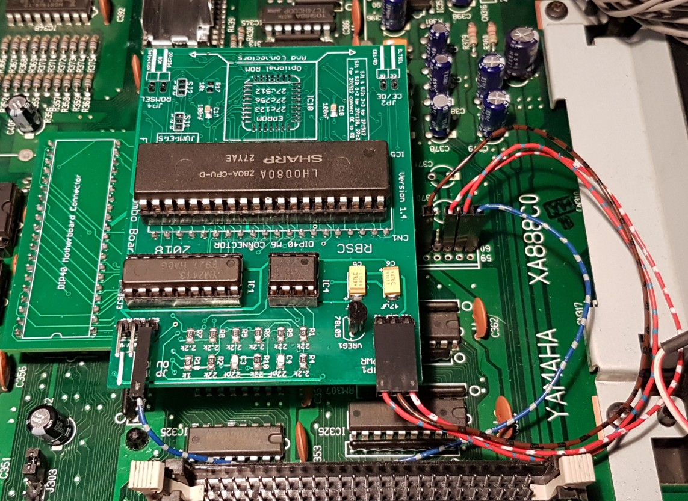

This concludes the required MSX2+ upgrade. Make sure that everything is connected correctly and power up the computer. If you see MSX2 logo with main RAM counter and your computer boots to Basic 3.0, then the upgrade was successful. To verify that FMPAC BIOS is correctly installed, run the **_music** command from MSX Basic. If you don't get a syntax error, then the BIOS is correctly installed. To verify the F4 port, just press the Reset button. If your computer reboots without showing the MSX logo, then the F4 port works correctly.

**NOTE:** Please note that the built-in Painter graphics editor that was present in the Russian versions of YIS805/128, will no longer be available after the upgrade. Its place is taken by other ROMs that are necessary for the proper conversion to MSX2+.

## Optional modifications

As mentioned earlier, the optional modifications will increase the usability and the value of the upgraded MSX2+ computer. One of the most important modifications is the RAM upgrade. Normally YIS805 computers have 128kb of RAM installed on the motherboard. It is possible to upgrade this amount of RAM to 256kb very easily. First, you need to install four DIP18 sockets onto the motherboard as shown on the below image:

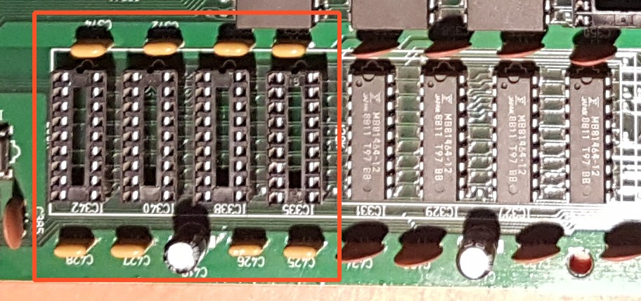

Then you need to install 8 ceramic 100nF capacitors on C425, C426, C427, C428, C363, C365, C372 and C374 placeholders and also add one electrolytic 100uF 16v capacitor on C419 placeholder. Please mind the capacitor's polarity when installing it. Then you can insert 4 DRAM chips into the sockets. The chips must be x464 DRAM with speeds from 80 to 120ns. The fully upgraded RAM looks like that:

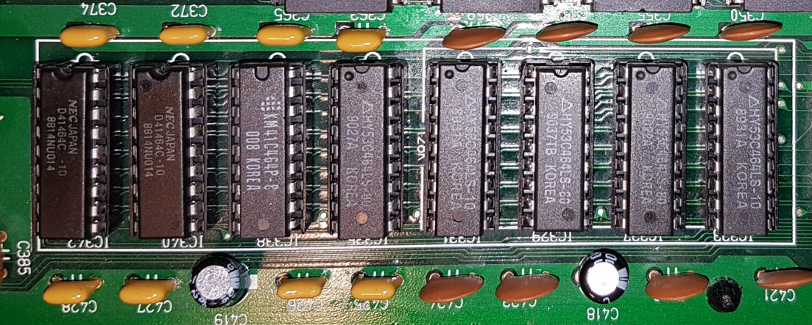

You may also install the sockets to other RAM chips if you want. This way you will be able to quickly fix the computer if your RAM fails for whatever reason. The final step in the RAM upgrade is installing 2 configuration jumpers. Those are not normal 2.5mm jumpers that you got used to, so you need to create a custom jumper from the 3-pin Dupont connector. The outer pins must be joined together with a wire. To be able to install the jumpers you need to desolder the factory-installed wires from J305 and J306.

The J305 placeholder needs to be fitted with the 5-pin jumper pin header with the 2nd and 4th pins removed. The J306 needs to be fitted with the 3-pin jumper pin header with the middle pin removed. The prepared jumpers should be installed as shown on the pictures below. In case you will need to revert the RAM upgrade, you will need to remove J306 and move J306 to the left. Then you will have 128kb of RAM again.

    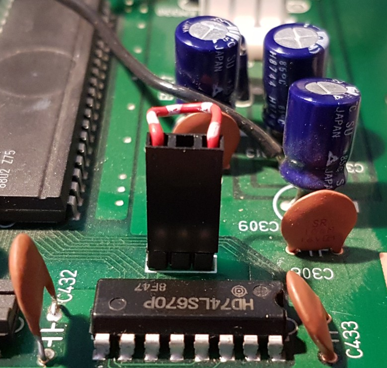
    &thinsp;
    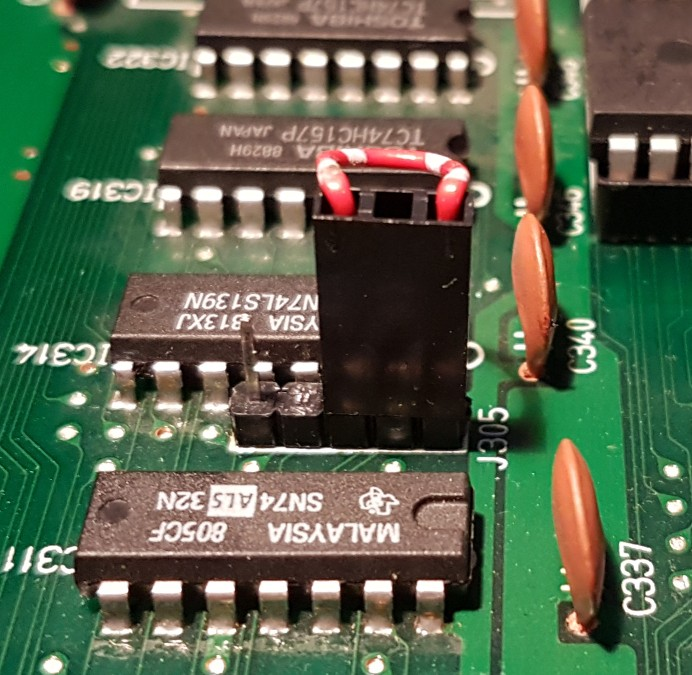

Power up your computer and observe the doubled RAM amount. If your computer doesn't boot, check all modifications and/or replace the RAM chips with the known good ones.

As old floppy drives and diskettes are unreliable after 30 years of service, it's recommended to install the modern Gotek floppy emulator instead of the first floppy drive of the YIS805 computer. This will give you the possibility to have 999 disk images at hand any time. The installation is pretty simple and requires only the 3D-printed holder for the Gotek to properly fit it into the front panel of the computer. The 3D model can be downloaded from RBSC's repository on Thingiverse:
-   **https://www.thingiverse.com/thing:3816802**

First you need to set the DS0 jumper on the Gotek emulator's board and install it into the MSX's case. Please make sure that you connect the interface and power cables correctly. It's recommended to flash the emulator with the FlashFloppy firmware before installation and to configure the FF.CFG file to use the Gotek emulator for the MSX platform. See the FlashFloppy's documentation for more info. The properly installed Gotek emulator looks like that:

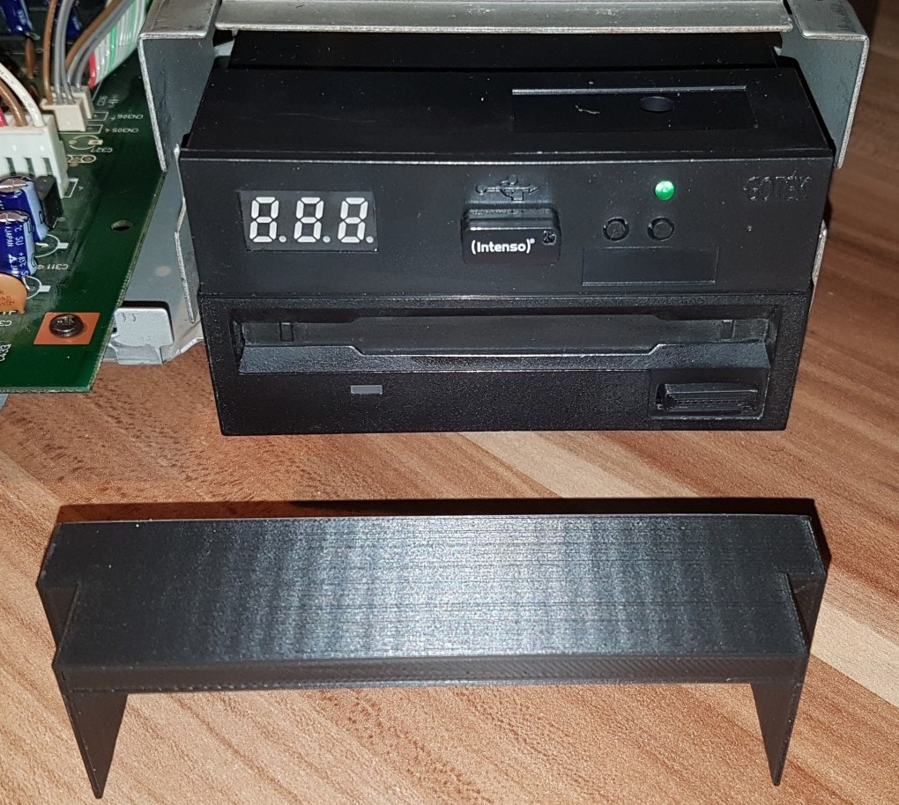

The 3D-printed part is installed on top of the Gotek's case, then the front panel is attached to the MSX's case so that there are no gaps between the emulator's case and the front panel. See the below picture for reference.

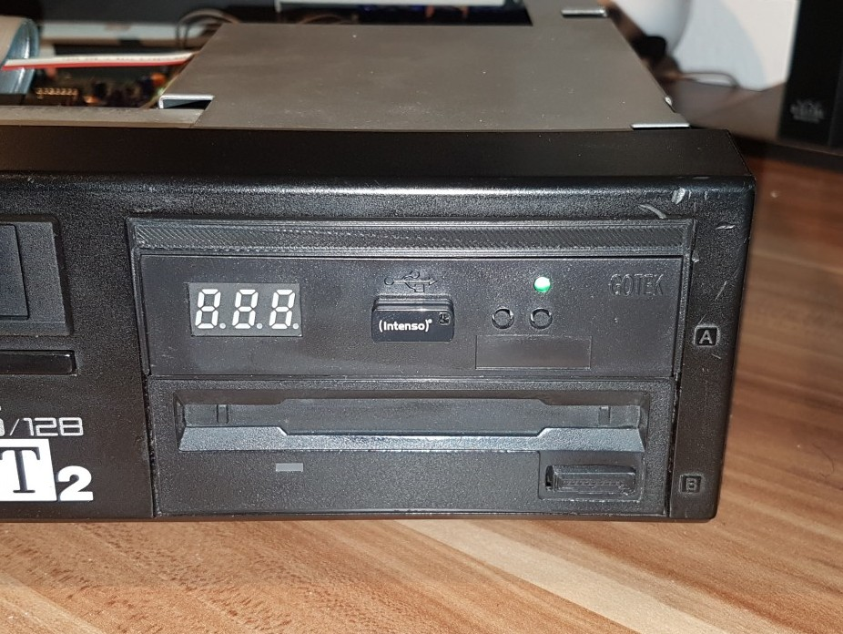

After installation please power up the computer and check that you can boot from the mounted DSK image located on the USB drive. If the computer only boots to MSX Basic, use the **"files"** command (without quotes) to list the directory of the mounted DSK image. If the image is not mounted, please check whether the Gotek emulator is properly powered and connected to the motherboard. Also check that the mounted DSK image is good.

For even better usability you can install an OLED screen into the Gotek emulator's case. Then you will see the names of mounted DSK images and the disk activity. More info on installing the OLED screens into the Gotek you might want to check the corresponding topics on **https://www.msx.org** or **https://zx-pk.ru** (for Russian-speaking people) forums.

The final optional upgrade that could be done for the YIS805 and similar computers is installing the improved video board. In the Russian versions of this computer the video boards could only output black and white composite video and color RGB signals. The new video board adds a decent quality color composite video and excellent quality S-Video capabilities. The board was designed by RBSC for the MSX2+ upgrade and it looks like that:

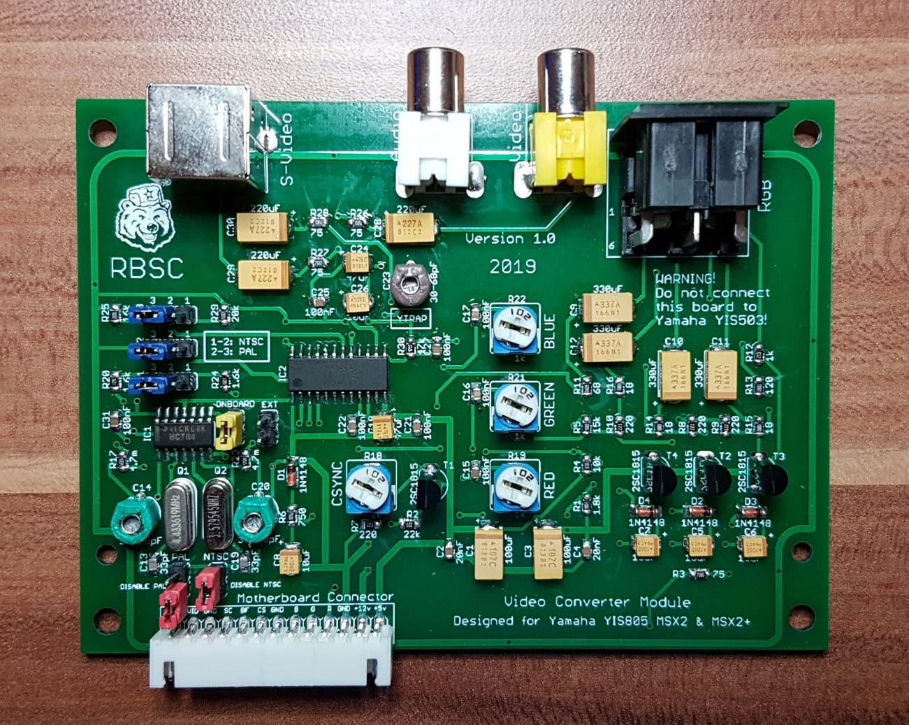

The new video board is available as the open-source project in RBSC's Github repository:
-   **https://github.com/RBSC/YIS805_VideoBoard**

It replaces the original video board and the only modification that you need to do is to drill a hole for the S-Video cable. The center of the new hole must be **33mm** away from the center of the audio output's hole. The **size of the hole should be the same** as for the audio/video outputs and it should be **on the same level** with them or a little higher. If necessary, adjust the hole with a filer so that the cables are connected without an effort.

**NOTE:** On some YIS805 and similar models the necessary hole may already be there - it is used for RF output from the original video board.

When the board is properly installed, the cable connections to it look like that:

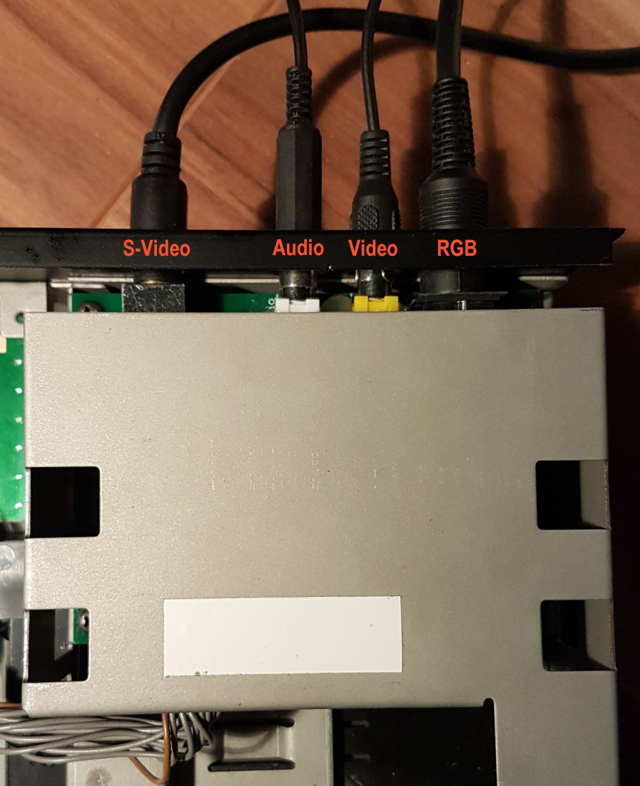

Before installing the video board into the case, please make sure that it works well with your freshly-upgraded MSX2+ computer. You can connect the video board to the cable coming from the motherboard and test the outputs. Choose a good MSX2+ game for testing, for example **Sonyc**. It will test the video board, the installed Gotek emulator and the FMPAC sound card. The board can be placed on the top of the computer's case, just make sure that it's not touching any metal under it. Here's the picture of the final testing:

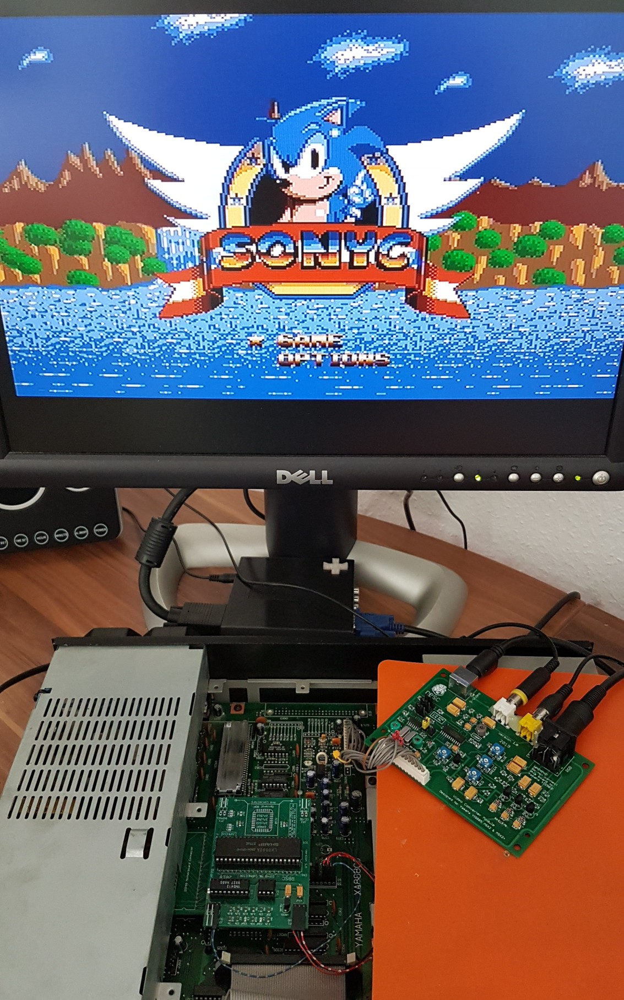

**If everything works well, then your MSX2+ upgrade is complete and you can now give yourself a pat on the back. WELL DONE! If you have any questions, feel free to approach anyone from RBSC on the forums and ask your question. We will try to reply as soon as possible.**

## Credits

We, the RBSC, enjoyed creating this MSX2+ upgrade for you! The following individuals made this upgrade possible or supported its creation with their expertise:
-   [RBSC] Wierzbowsky (Germany)
-   [RBSC] Pencioner (Sweden)
-   [RBSC] Ptero (Russia)
-   [RBSC] DJS3000 (Russia) - thanks for the video!
-   [RBSC] TNT23 (Russia) - big thanks for the keyboard for YIS805!
-   Petr Andreev (Russia) - big thanks for YIS805/128 and arranging its delivery!
-   Kamil Karimov (Russia)
-   Maxim Vlasov (Switzerland)
-   Evgeny Brychkov (Russia)
-   GreyWolf (Russia)

And those who opposed or tried to prevent this MSX2+ upgrade one way or another (you know who you are) will not be mentioned here. Let them stay in the dark shadows of their own pride forever. Amen!

## P.S.

The dedicated topics about this MSX2+ upgrade:
-   **https://www.msx.org/forum/msx-talk/hardware/upgrading-yamaha-yis805-to-msx2**
-   **https://zx-pk.ru/threads/30796-apgrejd-yamakhi-yis805-128-do-msx2.html**

This documentation is always available here:
-   **http://podrezov.com/yis805gotek/Yamaha%20YIS805%20Upgrade%20Guide.doc**
